## Part 1. Remote node configuration via Ansible

#### Create three machines using Vagrant - manager, node01, node02. Do not install docker using shell scripts when creating machines on Vagrant! Forward the node01 ports to the local machine to access the undeployed microservice application.
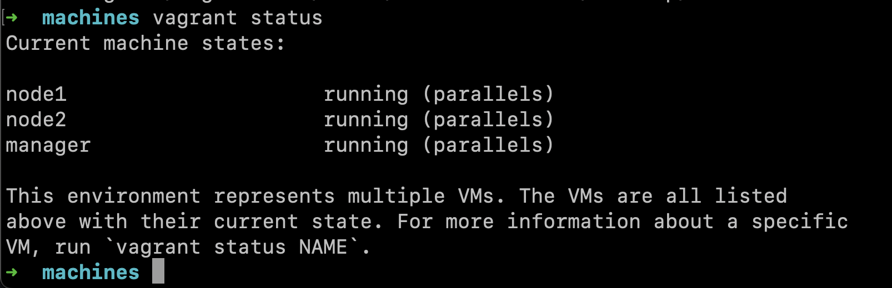
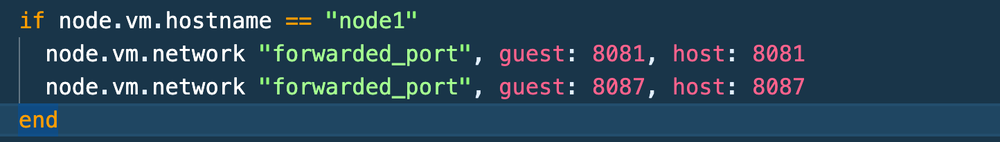

#### Prepare manager as a workstation for remote configuration:
##### 1. Go to manager.
##### 2. Check the connection to node01 via ssh on a private network.
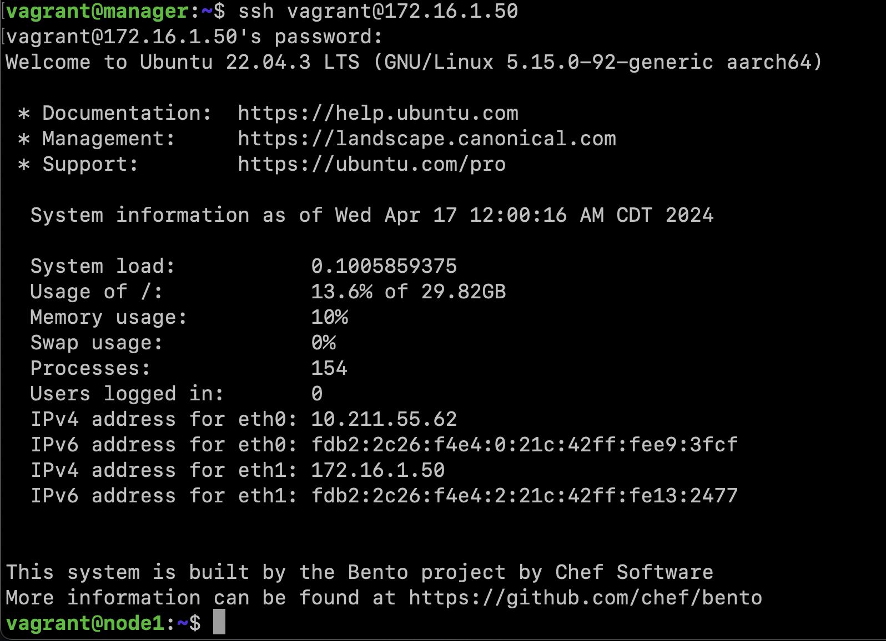
##### 3. Generate a ssh key to connect to node01 from the manager (without passphrase).
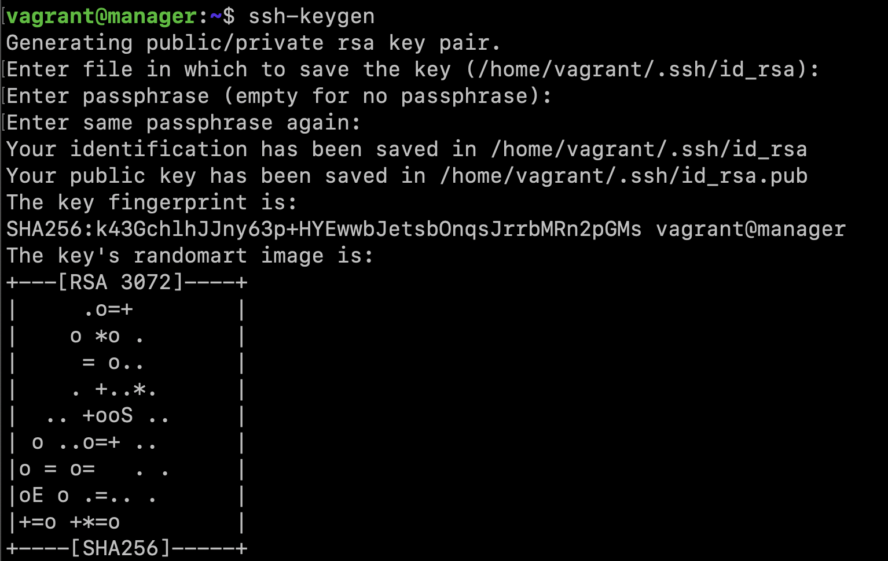
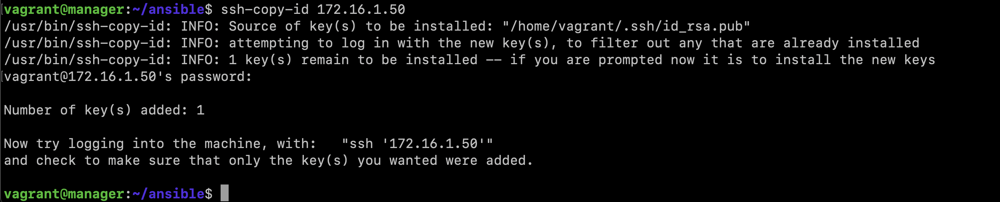
##### 4. Copy the docker-compose file and the source code of the microservices to the manager. (Use the project from the src folder and the docker-compose file from the previous chapter.)
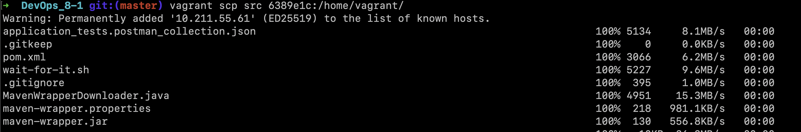
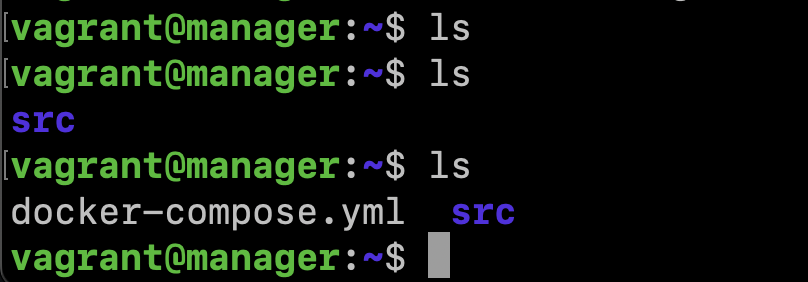
###### 5. Install Ansible on the manager and create ansible folder in which create the inventory file.
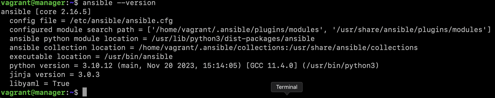
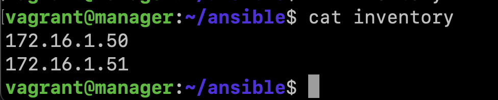
###### 6. Use the ping module to check the connection via Ansible.
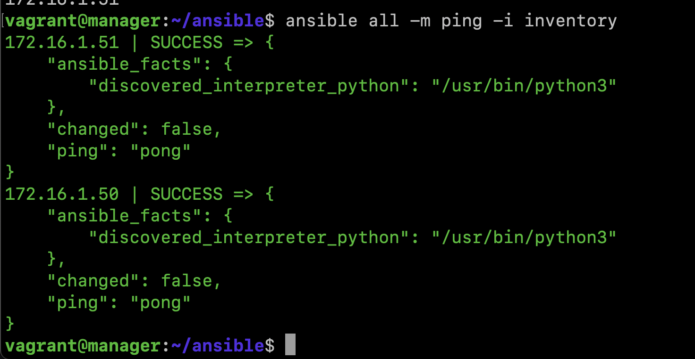

#### Write the first playbook for Ansible that performs apt update, installs docker, docker-compose, copies the compose file from the manager and deploys the microservice application.
> You can find all the necessary files in the /src/ansible01/ directory
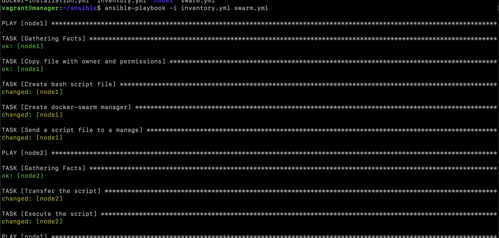
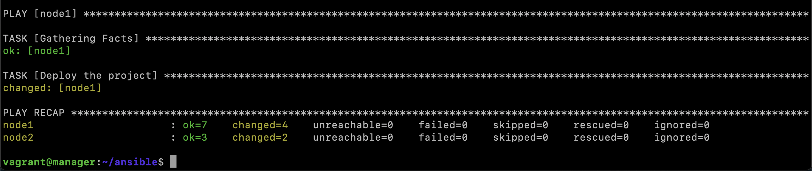

#### Run the prepared tests through postman and make sure that they are all successful. Show the test results in the report
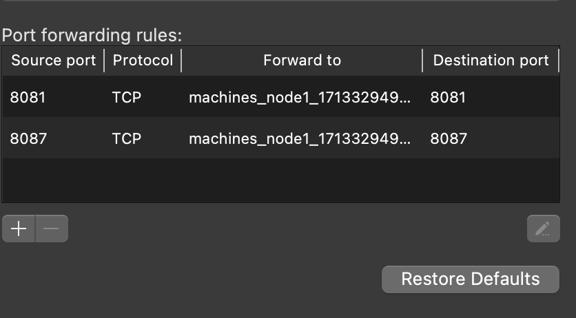
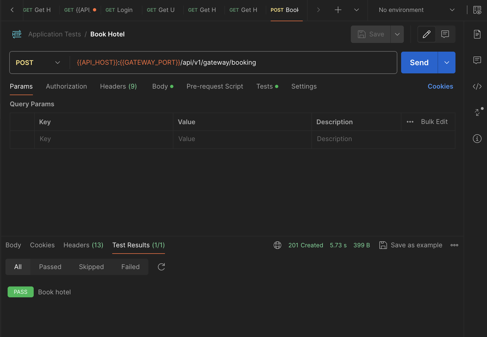
> ETC 

